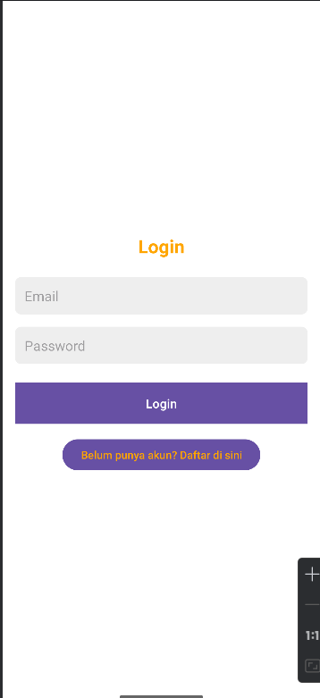
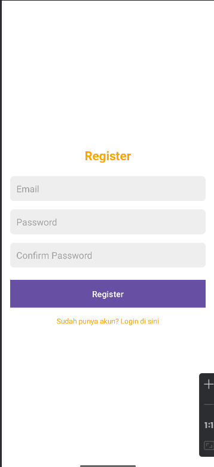
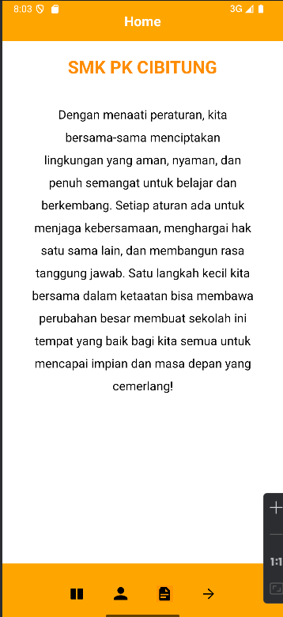
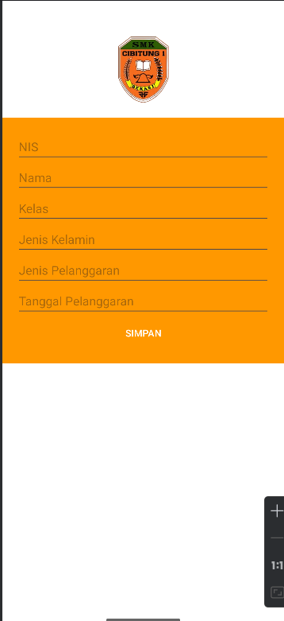
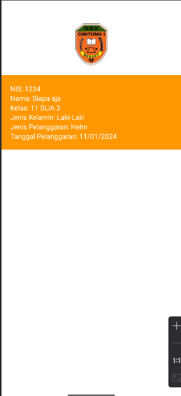

# DISIPLINKU - Aplikasi Mobile Pencatat Pelanggaran Siswa

**DISIPLINKU** adalah aplikasi mobile yang dirancang untuk mencatat dan mengelola data siswa yang melanggar aturan sekolah. Aplikasi ini memberikan kemudahan untuk mengisi data pelanggaran, serta menyediakan menu untuk Login, Register, Home, Isi Data, dan List.

## Fitur Utama

- **Login**: Mengakses aplikasi dengan akun yang sudah terdaftar.
- **Register**: Mendaftar akun baru untuk mengakses aplikasi.
- **Home**: Halaman utama yang memberikan informasi dan navigasi ke berbagai menu.
- **Isi Data**: Fitur untuk menginput data pelanggaran siswa.
- **List**: Menampilkan daftar pelanggaran siswa yang sudah tercatat.

## Tampilan Aplikasi


## Gambar dan Animasi Menu Aplikasi

### 1. **Login**
   Halaman Login untuk mengakses aplikasi dengan akun yang terdaftar.

   

### 2. **Register**
   Pengguna baru dapat mendaftar untuk membuat akun mereka sendiri.

   

### 3. **Home**
   Halaman utama yang menyajikan navigasi dan informasi tentang aplikasi.

   

### 4. **Isi Data**
   Fitur untuk mengisi data pelanggaran siswa, termasuk nama siswa, jenis pelanggaran, dan tanggal pelanggaran.

   

### 5. **List**
   Menampilkan daftar siswa yang telah terdaftar dengan pelanggarannya.

   

## Instalasi

### Prasyarat

Pastikan perangkat Anda sudah terpasang:

- Android Studio
- Emulator Android atau perangkat Android

### Langkah-langkah Instalasi

1. Clone repository ini ke dalam direktori lokal Anda:
   ```bash
   git clone https://github.com/DimNih/Apk_DISIPLINKU.git
